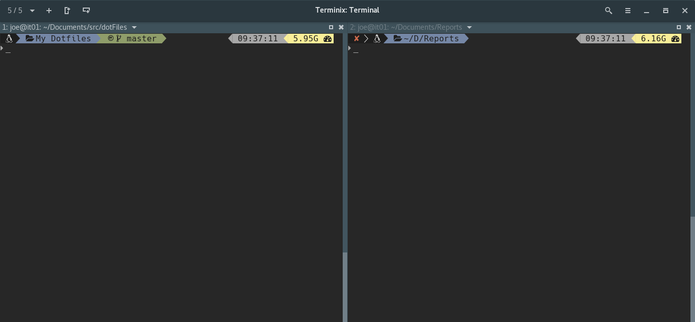

# dotFiles

[](https://www.codacy.com/app/Findarato/dotFiles?utm_source=github.com&utm_medium=referral&utm_content=Findarato/dotFiles&utm_campaign=badger)
[](https://travis-ci.org/Findarato/dotFiles)

Configuration and setup files for my computer.  


This repository currently contains the following dotFiles

Items Included

- .aliases
- .bashrc
- .dircolors
- .gitconfig
- .gitignore
- .gitmessage
- .gitmodules
- .powerlevel9k
- .zprofile
- .zshrc
- .ansible.cfg

To automatically create symlinks you can use the script linkup.sh. The file contents are displayed below

```bash
for FILE in .*; do
    if [ $FILE != .git ] && [ $FILE != . ] && [ $FILE != .. ]; then
        # echo "$FILE"
        echo "Linking Files"
        rm -f $HOME/$FILE
        ln -s $PWD/$FILE $HOME/$FILE
    fi
done
```

Current Screenshot of what the terminal will look like



## External References and projects being used.

These are projects that are being used that you need to self pull. I am not currently adding them as submodules because lets face it submodules are hard.

:octocat: [robbyrussell/oh-my-zsh][ad5c686c]

:octocat: [gabrielelana/awesome-terminal-fonts][e5317611]

:octocat: [bhilburn/powerlevel9k][9a267dc7]

[9a267dc7]: https://github.com/bhilburn/powerlevel9k "Github"
[ad5c686c]: https://github.com/robbyrussell/oh-my-zsh "Github"
[e5317611]: https://github.com/gabrielelana/awesome-terminal-fonts "Github"
